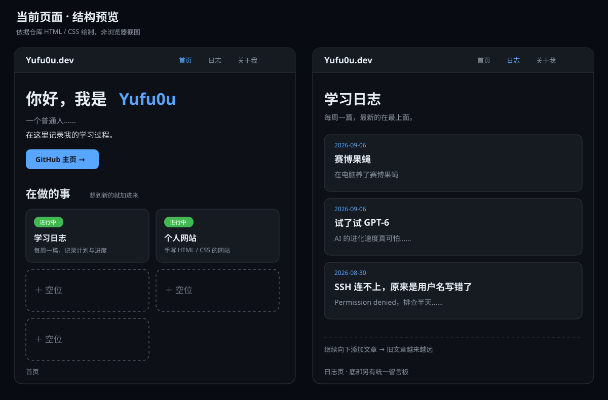

# 个人学习网站更新规划

> 2026-09-24 · 基于改版前仓库文件整理，方案已在当前仓库实施。本文保留改版前现状、目标结构和复用提示词；下方预览是依据代码绘制的结构示意，并非浏览器截图。

## 1. 改版前的网站与技术栈

| 项目 | 当前实现 | 依据 |
| --- | --- | --- |
| 页面 | `index.html` 首页、`blog.html` 学习日志、`about.html` 关于、`404.html` 错误页 | 仓库中的 4 个 HTML 文件 |
| 样式 | 原生 CSS，集中在 `style.css`；深色配色、响应式卡片、窄屏适配、减少动画设置 | `style.css` |
| 前端逻辑 | 没有项目自写的 JavaScript，也没有框架、包管理器或构建流程 | 当前文件结构 |
| 评论 | 日志页和关于页嵌入 giscus，通过 GitHub Discussions 留言，按 `pathname` 映射 | `blog.html`、`about.html` |
| 托管 | README 和页脚标注 GitHub Pages | `README.md`、各页页脚；本报告未核验线上部署状态 |
| 基础体验 | SVG 图标、页面描述和分享元信息、跳过导航链接、键盘焦点样式、404 页面 | 现有 HTML / CSS |

这是适合练习与小规模内容维护的纯静态站点。当前日志只有 3 篇：2026-09-06 两篇、2026-08-30 一篇；它们都以完整正文直接写在 `blog.html` 内。

## 2. 改版前预览与问题



| 位置 | 当前情况 | 更新原因 |
| --- | --- | --- |
| 首页 | 深色通用卡片模板；“在做的事”有 2 张真实卡片和 3 张“＋ 空位”卡片 | 空卡片没有内容或入口，占据主要视觉面积；页面缺少最近日志入口 |
| 日志 | 所有文章的正文按时间倒序连续排列；底部是统一留言板 | 新文章持续加入后，早期内容需要长距离下滑才能看到；无法按年份或关键词定位 |
| 内容维护 | 复制 `blog.html` 内的注释模板，在文件顶部插入新文章 | 一个文件同时承担目录与正文，内容增长后难以编辑、链接和复用 |
| 导航与视觉 | 三个页面的导航文字略有差异；配色和卡片样式接近通用深色模板 | 可以建立更清楚的视觉层级和一致的导航语义 |
| README | 同时包含技术信息与网站更新记录 | 项目说明的用途不够集中；更新计划和记录更适合独立文档或 Git 历史 |

**保留的有效部分：**关于页有真实介绍和联系入口，404 页可用，评论已经接入；这些不是“未建设页面”，不应仅为了精简而删除。首页的 3 个“空位”及仅供占位的样式可以删除。`style.css` 中未被使用的 `.comments-hint` 也可在实施时清理。

## 3. 更新目标与取舍

1. **先解决内容查找：**把日志页改为摘要目录，文章正文各有独立地址；提供年份筛选、标题/摘要搜索和每页 10 条的分页。
2. **保持练习项目易懂：**继续使用原生 HTML/CSS，只增加少量原生 JavaScript 来增强日志目录。目录的文章链接先写在 HTML 中；JavaScript 失效时仍能浏览全部目录并打开文章。
3. **删除无内容的占位：**首页只展示真实项目与真实日志；没有实际内容时不制造“即将上线”的卡片。
4. **提升辨识度：**采用“学习手记”风格：更鲜明的标题层级、日期与章节标识、节制的强调色、统一的间距和卡片规则。保留深色基调及舒适的正文阅读宽度。
5. **文档各司其职：**README 只说明技术实现和本地维护方式；本规划单独保存，网站经历由 Git 历史记录。

### 更新后信息结构

```text
首页 index.html
├─ 简洁自我介绍与查看日志入口
├─ 最近 3 篇日志（真实文章）
└─ 在做的事（仅真实项目）

日志目录 blog.html
├─ 标题 / 摘要关键词搜索
├─ 年份筛选与结果数量
├─ 每页 10 条摘要、日期、文章链接
└─ 上一页 / 下一页、无结果提示

文章详情 posts/日期-英文短名.html
├─ 标题、日期、正文、返回日志目录
└─ 对应该文章路径的 giscus 评论

关于 about.html：真实介绍、GitHub 入口、留言板
404.html：错误说明、返回首页
```

目录按日期从新到旧排列，日期相同的两篇保留当前先后顺序。每篇详情页的稳定 URL 便于直接分享和回访。先按现有内容迁移 3 篇，不补写不存在的正文；“第 0 周 / 第 1 周”等标签如继续保留，需先确认其含义，避免与日期重复或造成误解。

### 更新后预览


上图展示的是目标排版和操作层级，不代表最终文案或像素定稿。手机端改为单列：导航仍可触达，筛选控件纵向排列，日志条目整行可点，分页按钮有足够触控面积。文章详情继续使用窄阅读栏。

## 4. 具体改动清单

| 优先级 | 文件 / 模块 | 计划改动 | 完成判断 |
| --- | --- | --- | --- |
| P0 | `index.html` | 删除 3 个“＋ 空位”；重写首屏层级；加入最近 3 篇真实日志入口 | 首页没有虚构内容，访客能一步进入最近日志 |
| P0 | `blog.html`、`posts/` | 将 3 篇现有正文迁入独立详情页；目录只留日期、标题、简短原文摘录与链接 | 所有旧内容和先后顺序保留，每篇有可直接访问的 URL |
| P0 | `blog.html`、新增轻量脚本 | 搜索、年份筛选、每页 10 条分页；同步结果数量与空状态 | 早期文章无需一直下滑即可定位；筛选与翻页组合正常工作 |
| P0 | `style.css` | 统一首页、目录、详情和窄屏样式；删除占位卡片与无用占位提示样式 | 页面视觉一致，无横向溢出，键盘焦点清楚 |
| P1 | `about.html`、`404.html` | 统一导航文字和样式；核对可能过时的个人描述 | 页面链接、标题、导航状态正确；未确认的个人信息不被臆造 |
| P1 | giscus | 关于页保留留言板；文章详情使用各自 `pathname`；检查原日志页是否已有需要保留的讨论 | 现有讨论不会被无说明地丢弃；每篇详情页对应自己的评论 |
| P1 | `README.md` | 仅留项目技术概览、文件结构、本地预览、发布方式、评论配置与内容更新步骤；移出更新记录和宣传文案 | README 可以帮助维护项目，且不承担网站内容记录 |
| P1 | 全站 | 检查页面描述、分享地址、404、站内链接和可访问性 | 桌面与手机、鼠标与键盘都可完成核心浏览 |

**实施顺序：**先迁移文章并建立目录，再做搜索/筛选/分页，随后统一视觉和响应式布局，最后精简 README 并逐项验收。暂不引入框架、数据库、CMS 或构建工具；如果将来每年有大量文章、手动维护目录明显吃力，再评估静态站点生成器。

**评论迁移注意：**当前 `blog.html` 的 giscus 使用 `pathname`。将其改为文章详情评论后，原目录页的讨论不会自动出现在新 URL 下。实施前应检查是否存在实际留言；如有，保留可访问的旧讨论入口或明确迁移处理方案。

## 5. 验收标准

- 首页只有真实内容，所有卡片和按钮都通往有效页面；关于页与 404 页保持可用。
- 3 篇现有日志的文字、日期和顺序完整保留；每篇详情都能从目录和首页正确打开。
- 日志目录默认新到旧；搜索可匹配标题和摘要；年份筛选、分页可一起使用；无匹配时有清楚提示；筛选改变时回到第一页。
- 在没有 JavaScript 的情况下，日志目录仍能显示所有摘要与详情链接；分页增强失效不阻断阅读。
- 约 375px 手机宽度与常见桌面宽度下没有横向滚动，阅读、导航和点击区域正常。
- 键盘可使用导航、搜索、筛选和分页；页面保留跳到正文、可见焦点和减少动画支持。
- README 只包含技术说明及维护步骤；不写网站更新年表。
- 不新增虚构项目、日志、个人经历或未确认的联系方式；尊重仓库中已有的本地修改。

## 6. 可直接使用的详细提示词

以下提示词可在需要复用或重新生成这次改版时交给开发助手。它要求先读取代码，再实施和验证。

```text
请在当前仓库中实施 SITE_UPDATE_PLAN.md 的网站改版。先检查 git status 和现有文件，保留所有已存在的用户修改，尤其不要覆盖已暂存的 README 改动。阅读 index.html、blog.html、about.html、404.html、style.css、README.md 后再编辑。

目标：把这个使用原生 HTML/CSS、托管于 GitHub Pages 的个人学习网站，改成适合长期记录与回看早期日志的“学习手记”。保持静态部署，不引入框架、数据库、CMS、包管理器或构建步骤。可增加一个小型原生 JavaScript 文件，只负责日志目录的搜索、年份筛选、分页。

请按以下要求实施：
1. 首页：删除 3 个“＋ 空位”卡片及其不再使用的样式；只展示已经存在的项目和日志。重做标题、说明、行动入口、“最近日志”和“在做的事”的视觉层级。最近日志链接指向真实的文章详情，不编造内容。
2. 日志：把 blog.html 改为摘要目录。将当前 3 篇文章原文分别迁移到 posts/ 下的独立 HTML 文件，保留原日期、标题、文字和当前先后顺序；每篇提供稳定的英文/数字文件名、返回目录链接、页面标题和描述。目录中的每条包含日期、标题、基于原文的简短摘要和详情链接。不要补写未经用户提供的正文。
3. 查找旧文：默认日期倒序；提供关键词搜索（标题与摘要）、年份筛选、每页 10 条分页、结果数量及无结果提示。筛选改变时重置到第一页；筛选与分页组合工作。使用语义化控件、可见标签和键盘可操作按钮。目录摘要及链接原本就在 HTML 中；JavaScript 只增强显示，脚本不可用时全部目录仍可阅读。
4. 评论：关于页保留现有 giscus 留言板。文章详情按其路径加载 giscus。当前 blog.html 的 giscus 使用 pathname 映射；先检查是否有可以从代码或可用环境确认的旧讨论。不要假设旧讨论会自动迁入详情页；若无法核验，保留一个可访问旧讨论的方式，并在交付说明里指出。
5. 视觉：以深色“学习手记”为方向，建立统一的排版、间距、颜色变量和交互状态，让首页、目录、详情、关于、404 看起来属于同一站点。避免堆砌装饰和大面积空卡片。正文保持适合阅读的行长；手机约 375px 时单列，无横向溢出。保留跳到正文、焦点样式、prefers-reduced-motion 支持。
6. 导航与文案：统一全站导航名称和当前页状态；检查站内链接、页脚、meta description 和分享信息。about.html 中可能过时的“机电专业大二在读”等描述不得自行更新为新事实，必要时保留原文并在总结中提醒用户核对。
7. README：仅保留技术说明，例如技术栈、文件结构、本地预览方式、GitHub Pages 发布、giscus 配置与新增日志的维护步骤。删除更新记录和非技术宣传内容。不要把本规划文档当作 README 的正文。

完成后做必要验证：检查全部站内链接和 HTML 结构；核对 3 篇迁移内容；验证搜索、年份筛选、分页、无结果状态及无 JavaScript 回退；检查桌面和手机布局、键盘操作。报告实际修改、验证结果及仍需用户确认的事实，不要只给建议或示例代码。
```
